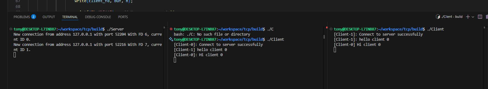

# Inpisration 
To demonstrate how to use the TCP to establish a robust and secure connection


## Details
### How to build the project
```
    cmake -B build
    cmake --build ./build
    # Then Client and Server binaries will be placed there.
```

## Applications
### Communicate between multiple clients
